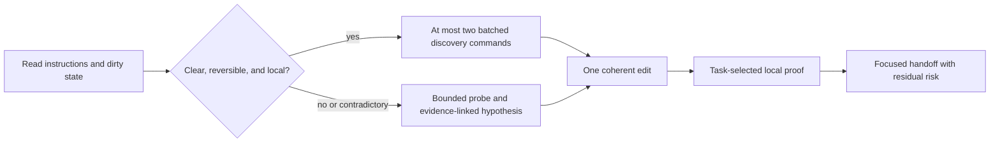

# Endurant Harness

### Bounded repository changes with executable local verification

Endurant Harness is a lightweight Agent Skill for Codex and Claude Code. It provides a direct workflow for clear, reversible changes and a bounded discovery and verification workflow for uncertain or high-risk work.

It is designed to improve implementation confidence without imposing a project-management workflow on routine changes.

> **Status:** v5 is an evaluation-backed release candidate. Local and synthetic evidence is documented below. Remote CI applies only to the tested commit; no GitHub release or cross-platform package is currently published.

## Contents

- [Get started](#get-started)
- [Why Endurant Harness](#why-endurant-harness)
- [Key features](#key-features)
- [How it works](#how-it-works)
- [Repository contracts](#repository-contracts)
- [Runtime commands](#runtime-commands)
- [Measured evidence](#measured-evidence)
- [Project layout](#project-layout)
- [Development and release](#development-and-release)
- [Limits](#limits)
- [License](#license)

## Get started

### Requirements

- Codex or Claude Code
- Git
- `curl` for the one-line installer
- Python 3.10 or newer
- `rg` recommended for task-aware repository search

### Install or update

```bash
curl -fsSL https://raw.githubusercontent.com/EndurantDevs/endurant-harness/main/install.sh | sh
```

The installer audits the downloaded package, installs the same source for both hosts, keeps one `.endurant-harness.previous` rollback, and refuses unrelated or duplicate targets. Rerun it to update. Until a tagged release is published, the one-liner follows `main`.

Install only one host:

Codex:

```bash
curl -fsSL https://raw.githubusercontent.com/EndurantDevs/endurant-harness/main/install.sh | ENDURANT_AGENT=codex sh
```

Claude Code:

```bash
curl -fsSL https://raw.githubusercontent.com/EndurantDevs/endurant-harness/main/install.sh | ENDURANT_AGENT=claude sh
```

To inspect the installer first, download [`install.sh`](install.sh), review it, then run it. From a checkout, install the audited local package explicitly:

```bash
sh install.sh --source .
```

Codex also has a native first-install path. Ask in a task:

```text
$skill-installer install https://github.com/EndurantDevs/endurant-harness/tree/main/endurant-harness
```

The standalone package preserves the standard skill name and requires no hooks, MCP server, Node runtime, or host-specific marketplace. Plugin packaging can be added if versioned marketplace distribution becomes a release requirement.

### Invoke it

In Codex:

```text
$endurant-harness implement this change and prove it locally
```

In Claude Code:

```text
/endurant-harness implement this change and prove it locally
```

Both hosts discover personal Agent Skills from their user skill directories. Start a fresh task after installation when exact loaded-version certainty matters; do not claim `current` provenance unless the task supplies its loaded marker. See the official [Codex skill documentation](https://learn.chatgpt.com/docs/build-skills) and [Claude Code skill documentation](https://code.claude.com/docs/en/slash-commands).

## Why Endurant Harness

- **Low overhead for routine work.** Clear, reversible changes skip probes, plan files, checkpoints, subagents, and broad test suites.
- **Bounded discovery.** The direct lane permits at most two batched discovery commands before editing and escalates when additional investigation is required.
- **Task-specific verification.** Performance work uses an identical before-and-after workload with correctness checks; ordinary correctness work does not run an unrelated benchmark.
- **Earlier local feedback.** Repository-owned preflight can cover focused tests, lint, type checks, builds, generated outputs, and affected packages before remote CI.
- **Worktree preservation.** Dirty worktrees and unrelated edits are identified and preserved.
- **False-green protection.** The runner can require behavior evidence, intended-test output, deadlines, cleanup, and an exact final-diff fingerprint.

## Key features

| Feature | Purpose |
| --- | --- |
| Direct and escalated lanes | Spend discovery only when uncertainty or risk requires it |
| Symbol-first repository probe | Rank exact snake_case and camelCase source/test hits while suppressing unrelated harness noise |
| Task-selected verification | Choose focused, synthetic, affected-scope, local-CI, and diff checks from the requested behavior |
| Staged command runner | Execute explicit argv plans with timeouts, evidence kinds, bounded summaries, and full external logs |
| Configured false-green defenses | Require intended-test output and reject output mismatches, stale proof, deadline overruns, and post-proof diff mutation when the corresponding guards are enabled |
| Optional fast preflight | Run one trusted repository bundle plus only uncovered checks |
| Optional benchmark receipts | Bind unchanged workload and correctness across one baseline and one final measurement |
| Session provenance | Report `current`, `stale`, or `unknown` without pretending an active task reloaded |
| Standard-library runtime | Run without installing Python packages |

## How it works



The direct lane is for clear, localized work with a known proof path. For a reported behavior regression, add or update the focused regression check, confirm it fails, then implement the fix. Features, internal refactors, and performance work do not require an artificial failing baseline.

The escalated lane is for uncertainty, contradictions, coupling, performance, migrations, security, deployment, or material risk. It uses one bounded probe, one root-cause change, and one staged proof packet. If evidence contradicts the approach, the harness returns to discovery before making additional changes.

## Repository contracts

Host `AGENTS.md` or `CLAUDE.md` remains the canonical project guidance. Endurant adds three optional files under `.agents/`:

| File | Role |
| --- | --- |
| `endurant-harness-profile.md` | Human-readable project shape, commands, constraints, environment notes, and completion policy |
| `endurant-harness-preflight.json` | Trusted coverage map for one local-CI bundle plus uncovered checks |
| `endurant-harness-benchmarks.json` | Same-workload benchmark command, source/workload manifests, correctness keys, metrics, and threshold |

The JSON contracts are opt-in. They must be Git-tracked, clean, regular files and hash-pinned from the probe. Malformed, stale, symlinked, untracked, or proof-mutating contracts fail closed. Repositories without them keep the ordinary workflow and cost.

See [`endurant-harness/references/repository-profile.md`](endurant-harness/references/repository-profile.md) for schemas and examples.

## Runtime commands

The skill keeps one public standard-library entry point:

```bash
PACKAGE=/absolute/path/to/endurant-harness

python3 -S "$PACKAGE/scripts/endurant.py" probe \
  --repo . --task "describe the implementation task"

python3 -S "$PACKAGE/scripts/endurant.py" template \
  > /tmp/endurant-proof-plan.json

python3 -S "$PACKAGE/scripts/endurant.py" run \
  /tmp/endurant-proof-plan.json --repo .

python3 -S "$PACKAGE/scripts/endurant.py" fingerprint --repo .

python3 -S "$PACKAGE/scripts/endurant.py" provenance \
  --loaded-provenance 'v5:<full-package-sha256>' --format json
```

`preflight` and `benchmark baseline|final` are usable only when their repository contracts exist and pass validation; otherwise use the ordinary workflow. The probe reports their content hashes so callers can pin the exact reviewed contract.

## Measured evidence

Adoption decisions are based on isolated deterministic tests, adversarial receipt mutation, and normalized local Codex tasks.

| Decision | Local result | Outcome |
| --- | --- | --- |
| Combined direct lane | Median wall `98.703s -> 50.221s`; uncached input `-19.70%` on two paired repeats of one clear synthetic task | Adopted as the base |
| Git-aware aggregate probe | `35.282s -> 0.099s` on the measured aggregate workspace | Adopted |
| Symbol-first relevance | Source and test in top three `1/12 -> 12/12`; candidate-path payload `-88.24%`; full-probe median slightly improved | Adopted |
| Two-command discovery | Median wall `54.733s -> 39.268s`; uncached input `-38.30%`; ambiguity canaries escalated without edits | Adopted provisionally |
| Conditional red-first | Honest fail-before-edit proof in both bug runs; no forced red step in feature/refactor canaries | Adopted only for behavior regressions |
| Fast-preflight contract | Duplicate proof slice `295.892ms -> 149.000ms`; `6/6` seeded failures caught | Optional pilot |
| Benchmark receipt | Eight mutation classes rejected; `0.147ms` median comparator cost | Optional pilot; extra core wording rejected |
| Explicit lane allowlist | Same `80/80` classification accuracy but `15.44%` slower | Rejected |
| Full Rust rewrite | Optimistic runtime ceiling remained below one percent of an end-to-end task and lacked CLI/platform parity | Rejected |
| v5 runtime safeguards | `+9.6ms` to `+11.8ms` median across 31 paired template, probe, and no-op runner samples; all parity gates passed | Accepted as negligible for real proof commands, not claimed as a runtime speedup |
| Provenance UX forward A/B | On two pairs, wall median `71.525s -> 61.033s`, uncached input `28,451 -> 19,621`, and provenance commands `3 -> 1`; all functional gates passed, while exact `current` provenance improved `1/2 -> 2/2` | Retain the current UX; favorable exploratory signal, not a general speed claim |

These are bounded local and synthetic results, not universal throughput claims. The full decision records, sample limits, hashes, and sanitized receipts are in [`reports/DECISION.md`](reports/DECISION.md), [`reports/NEXT-IMPROVEMENTS.md`](reports/NEXT-IMPROVEMENTS.md), [`reports/PROVENANCE-EFFICIENCY.md`](reports/PROVENANCE-EFFICIENCY.md), and [`artifacts/benchmarks/`](artifacts/benchmarks/).

## Project layout

| Path | Purpose |
| --- | --- |
| `install.sh` | Audited Codex/Claude Code install and update entry point |
| `endurant-harness/` | Audited installable v5 skill and release source |
| `subjects/current/` | Frozen pre-v5 installed baseline |
| `subjects/combined-candidate/` | Previously promoted base candidate |
| `subjects/<experiment>/` | Isolated experimental variants |
| `lab/` | Benchmarks, graders, proposal prototypes, integrity tests, and release checks |
| `fixtures/` | Neutral executable synthetic coding tasks |
| `artifacts/benchmarks/` | Sanitized reproducible receipts and aggregate measurements |
| `artifacts/runs/` | Ignored raw model output, logs, event sinks, and generated workspaces |
| `reports/` | Decisions, measured results, caveats, and rollout notes |

The README remains at the repository root. The installable skill and release ZIP intentionally contain no README, changelog, cache, bytecode, raw run, or temporary file.

## Development and release

Run the deterministic suite, strict skill audit, efficiency comparison, aggregate promotion checker, and staged local preflight before publishing a package:

```bash
PYTHONDONTWRITEBYTECODE=1 python3 -m unittest discover \
  -s lab/tests -p 'test_*.py' -v

PYTHONDONTWRITEBYTECODE=1 python3 -S \
  endurant-harness/scripts/audit_skill.py \
  endurant-harness --strict --format text

PYTHONDONTWRITEBYTECODE=1 python3 -S \
  endurant-harness/scripts/benchmark_efficiency.py \
  endurant-harness --format text

PYTHONDONTWRITEBYTECODE=1 python3 -S lab/check_results.py

PYTHONDONTWRITEBYTECODE=1 python3 -S \
  lab/provenance_efficiency_receipt.py check

PYTHONDONTWRITEBYTECODE=1 python3 -S \
  endurant-harness/scripts/endurant.py run \
  lab/local-ci-plan.json --repo .

PYTHONDONTWRITEBYTECODE=1 python3 -S \
  lab/build_v5_release.py verify-source \
  --package endurant-harness \
  --receipt artifacts/benchmarks/v5-release.json \
  --runtime-receipt artifacts/benchmarks/v5-runtime.json
```

The tracked source-only check reconstructs the deterministic archive in memory, so CI can verify its hash without storing release binaries. A local archive can be built with `python3 -S lab/build_v5_release.py build`; it must contain exactly one top-level `endurant-harness/` directory. Record the source revision, canonical package hash, strict-audit result, deterministic test result, benchmark receipt, archive SHA-256, and what was not verified.

## Limits

- Endurant Harness is for implementation and difficult debugging, not explanations, review-only work, or trivial edits.
- Local preflight does not prove remote CI, deployment, readiness, or live behavior.
- Current performance evidence uses synthetic tasks and limited repeated model runs.
- Fast-preflight and benchmark contracts are optional pilots; repository commands still execute with the caller's ambient authority.
- Existing tasks may retain older instructions. Missing or malformed loaded provenance is `unknown`, never `current`.
- The current release is Python-based. Rust microbenchmarks did not justify a parity rewrite.
- Cross-platform release packaging has not yet been demonstrated.
- The strict audit validates package structure and declared capability/runtime gates; it is not a security review or source-authenticity proof. Package hashes identify version and integrity state, not publisher identity.
- Evaluation and trigger catalogs are schema-checked specifications; only the separately reported runtime smoke cases execute during strict audit.

## License

No reuse license has been selected yet. Public availability of this repository is not a substitute for a license grant.
