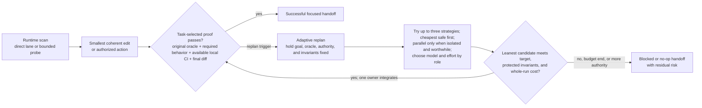
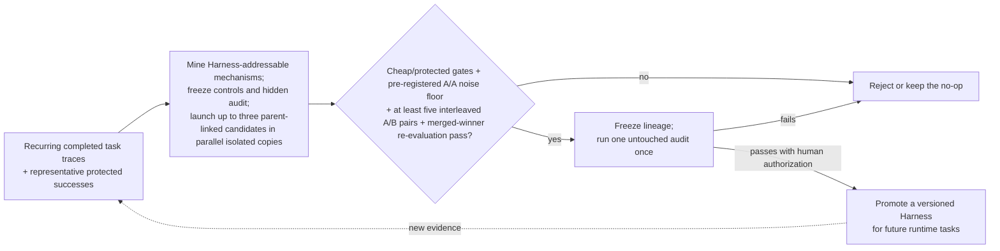

# Endurant Harness

### Bounded repository changes with executable local verification

Endurant Harness is a lightweight Agent Skill for Codex and Claude Code. It provides a direct lane for clear, reversible changes, a task-local adaptive replan loop for stalled or contradicted work, and a governed cross-task promotion loop for improving the Harness from repeated evidence.

It is designed to improve implementation confidence without imposing a project-management workflow on routine changes.

> **Status:** v6 is an evaluation-backed release candidate. Local, synthetic, and local-only task-level evidence is documented below. Remote CI applies only to the tested commit; no GitHub release or cross-platform package is currently published.

## Contents

- [Get started](#get-started)
- [Why Endurant Harness](#why-endurant-harness)
- [Key features](#key-features)
- [How it works](#how-it-works)
- [Repository contracts](#repository-contracts)
- [Runtime commands](#runtime-commands)
- [Measured evidence](#measured-evidence)
- [Project layout](#project-layout)
- [Development and release](#development-and-release)
- [Limits](#limits)
- [License](#license)

## Get started

### Requirements

- Codex or Claude Code
- Git
- `curl` for the one-line installer
- Python 3.10 or newer
- `rg` recommended for task-aware repository search
- Release maintainers only: Codex Skill Creator's `quick_validate.py` and PyYAML available to normal Python; neither is used by the installed Harness runtime

### Install or update

```bash
curl -fsSL https://raw.githubusercontent.com/EndurantDevs/endurant-harness/main/install.sh | sh
```

The installer audits the downloaded package, installs the same source for both hosts, keeps one `.endurant-harness.previous` rollback, and refuses unrelated or duplicate targets. Rerun it to update. Until a tagged release is published, the one-liner follows `main`.

Install only one host:

Codex:

```bash
curl -fsSL https://raw.githubusercontent.com/EndurantDevs/endurant-harness/main/install.sh | ENDURANT_AGENT=codex sh
```

Claude Code:

```bash
curl -fsSL https://raw.githubusercontent.com/EndurantDevs/endurant-harness/main/install.sh | ENDURANT_AGENT=claude sh
```

To inspect the installer first, download [`install.sh`](install.sh), review it, then run it. From a checkout, install the audited local package explicitly:

```bash
sh install.sh --source .
```

Codex also has a native first-install path. Ask in a task:

```text
$skill-installer install https://github.com/EndurantDevs/endurant-harness/tree/main/endurant-harness
```

The standalone package preserves the standard skill name and requires no hooks, MCP server, Node runtime, or host-specific marketplace. Plugin packaging can be added if versioned marketplace distribution becomes a release requirement.

### Invoke it

In Codex:

```text
$endurant-harness implement this change and prove it locally
$endurant-harness recover this resumable operation and prove final state
```

In Claude Code:

```text
/endurant-harness implement this change and prove it locally
/endurant-harness recover this resumable operation and prove final state
```

Both hosts discover personal Agent Skills from their user skill directories. Start a fresh task after installation when exact loaded-version certainty matters; do not claim `current` provenance unless the task supplies its loaded marker. See the official [Codex skill documentation](https://learn.chatgpt.com/docs/build-skills) and [Claude Code skill documentation](https://code.claude.com/docs/en/slash-commands).

## Why Endurant Harness

- **Low overhead for routine work.** Clear, reversible changes skip probes, plan files, checkpoints, subagents, and broad test suites.
- **Bounded discovery.** The direct lane permits at most two batched discovery commands before editing and escalates when additional investigation is required.
- **Runtime adaptation.** When decisive evidence stalls or contradicts an approach, agents keep the task contract fixed, try the cheapest safe strategy, and parallelize independent variants only when isolation and expected wall-time savings justify coordination.
- **Governed evolution.** Recurring mechanisms can become bounded Harness candidates only through frozen evaluation, protected successes, an untouched audit, and human-authorized promotion.
- **Task-specific verification.** Performance work uses an identical before-and-after workload with correctness checks; ordinary correctness work does not run an unrelated benchmark.
- **Earlier local feedback.** Repository-owned preflight can cover focused tests, lint, type checks, builds, generated outputs, and affected packages before remote CI.
- **Worktree preservation.** Dirty worktrees and unrelated edits are identified and preserved.
- **False-green protection.** The runner can require behavior evidence, intended-test output, deadlines, cleanup, and an exact final-diff fingerprint.

## Key features

| Feature | Purpose |
| --- | --- |
| Direct and escalated lanes | Spend discovery only when uncertainty or risk requires it |
| Runtime adaptive replan | Hold the task contract fixed, try up to three materially different strategies, and parallelize isolated candidates only when worthwhile |
| Governed cross-task promotion | Mine recurring evidence, compare bounded Harness variants, and require an untouched audit plus human authorization |
| Symbol-first repository probe | Rank exact snake_case and camelCase source/test hits while suppressing unrelated harness noise |
| Task-selected verification | Choose focused, synthetic, affected-scope, local-CI, and diff checks from the requested behavior |
| Staged command runner | Execute explicit argv plans with timeouts, evidence kinds, bounded summaries, and full external logs |
| Configured false-green defenses | Require intended-test output and reject output mismatches, stale proof, deadline overruns, and post-proof diff mutation when the corresponding guards are enabled |
| Optional fast preflight | Run one trusted repository bundle plus only uncovered checks |
| Optional benchmark receipts | Bind unchanged workload and correctness across one baseline and one final measurement |
| Session provenance | Report `current`, `stale`, or `unknown` without pretending an active task reloaded |
| Standard-library runtime | Run without installing Python packages |

## How it works

### Runtime task loop



The direct lane is for clear, localized work with a known proof path. For a reported behavior regression, add or update the focused regression check, confirm it fails, then implement the fix. Features and internal refactors do not require an artificial failing baseline. Performance work also needs no artificial red step, but it always escalates to an identical-workload benchmark with correctness proof.

The escalated lane is for uncertainty, contradictions, coupling, performance, migrations, security, deployment, or material risk. If the replan gate trips, the loaded Harness and decisive oracle stay fixed while agents try up to three bounded strategies, cheapest safe first. Independent variants run in parallel only when their copies, resources, and evidence are isolated and expected savings exceed coordination cost. Agent names use `target_role_scope`, such as `import_optimizer_transform`; a host-added path such as `/root/` is routing metadata. One owner integrates the leanest result that meets the target without protected regression or unacceptable whole-run cost, then reruns the original proof; an evidence-backed no-op is valid.

### Governed cross-task promotion loop

Successful and blocked/no-op handoffs can supply completed traces to the separate promotion loop. Only a human-authorized promoted version affects future runtime tasks.



Cross-task promotion is a separate maintenance loop, not runtime self-rewriting. It mines recurring causal evidence from completed development or authorized operations, freezes the comparison contract, evaluates isolated parent-linked Harness candidates, rechecks merged winners, and uses one untouched audit. Installing, committing, pushing, or changing live policy still requires human authorization.

## Repository contracts

Host `AGENTS.md` or `CLAUDE.md` remains the canonical project guidance. Endurant adds three optional files under `.agents/`:

| File | Role |
| --- | --- |
| `endurant-harness-profile.md` | Human-readable project shape, commands, constraints, environment notes, and completion policy |
| `endurant-harness-preflight.json` | Trusted coverage map for one local-CI bundle plus uncovered checks |
| `endurant-harness-benchmarks.json` | Same-workload benchmark command, source/workload manifests, correctness keys, metrics, and threshold |

The JSON contracts are opt-in. They must be Git-tracked, clean, regular files and hash-pinned from the probe. Malformed, stale, symlinked, untracked, or proof-mutating contracts fail closed. Repositories without them keep the ordinary workflow and cost.

See [`endurant-harness/references/repository-profile.md`](endurant-harness/references/repository-profile.md) for schemas and examples.

## Runtime commands

The skill keeps one public standard-library entry point:

```bash
PACKAGE=/absolute/path/to/endurant-harness

python3 -S "$PACKAGE/scripts/endurant.py" probe \
  --repo . --task "describe the implementation task"

python3 -S "$PACKAGE/scripts/endurant.py" template \
  > /tmp/endurant-proof-plan.json

python3 -S "$PACKAGE/scripts/endurant.py" run \
  /tmp/endurant-proof-plan.json --repo .

python3 -S "$PACKAGE/scripts/endurant.py" fingerprint --repo .

python3 -S "$PACKAGE/scripts/endurant.py" provenance \
  --loaded-provenance 'v6:<full-package-sha256>' --format json
```

`preflight` and `benchmark baseline|final` are usable only when their repository contracts exist and pass validation; otherwise use the ordinary workflow. The probe reports their content hashes so callers can pin the exact reviewed contract.

## Measured evidence

Adoption decisions are based on isolated deterministic tests, adversarial receipt mutation, and normalized local Codex tasks.

| Decision | Local result | Outcome |
| --- | --- | --- |
| Combined direct lane | Median wall `98.703s -> 50.221s`; uncached input `-19.70%` on two paired repeats of one clear synthetic task | Adopted as the base |
| Git-aware aggregate probe | `35.282s -> 0.099s` on the measured aggregate workspace | Adopted |
| Symbol-first relevance | Source and test in top three `1/12 -> 12/12`; candidate-path payload `-88.24%`; full-probe median slightly improved | Adopted |
| Two-command discovery | Median wall `54.733s -> 39.268s`; uncached input `-38.30%`; ambiguity canaries escalated without edits | Adopted provisionally |
| Conditional red-first | Honest fail-before-edit proof in both bug runs; no forced red step in feature/refactor canaries | Adopted only for behavior regressions |
| Fast-preflight contract | Duplicate proof slice `295.892ms -> 149.000ms`; `6/6` seeded failures caught | Optional pilot |
| Benchmark receipt | Eight mutation classes rejected; `0.147ms` median comparator cost | Optional pilot; extra core wording rejected |
| Explicit lane allowlist | Same `80/80` classification accuracy but `15.44%` slower | Rejected |
| Full Rust rewrite | Optimistic runtime ceiling remained below one percent of an end-to-end task and lacked CLI/platform parity | Rejected |
| v5 runtime safeguards | `+7.846ms` to `+13.148ms` median across 31 paired template, probe, and no-op runner samples; all parity gates passed | Accepted as negligible for real proof commands, not claimed as a runtime speedup |
| Provenance UX forward A/B | On two pairs, wall median `71.525s -> 61.033s`, uncached input `28,451 -> 19,621`, and provenance commands `3 -> 1`; all functional gates passed, while exact `current` provenance improved `1/2 -> 2/2` | Retain the current UX; favorable exploratory signal, not a general speed claim |

These are bounded local and synthetic results, not universal throughput claims. The full decision records, sample limits, hashes, and sanitized receipts are in [`reports/DECISION.md`](reports/DECISION.md), [`reports/NEXT-IMPROVEMENTS.md`](reports/NEXT-IMPROVEMENTS.md), [`reports/PROVENANCE-EFFICIENCY.md`](reports/PROVENANCE-EFFICIENCY.md), [`reports/RELEASE-v6.md`](reports/RELEASE-v6.md), and [`artifacts/benchmarks/`](artifacts/benchmarks/).

The v6 lab adds two separate executable evidence paths: `run_adaptive_replan.py` compares isolated task-local strategies from the exact failed state and lets one owner replay the leanest proved result; `run_promotion_campaign.py` freezes a parent/candidate/no-op campaign, A/A noise floor, interleaved A/B pairs, confirmation, raw captures, and a pre-sealed one-use audit. Evidence labels remain fail-closed: tooling/tests alone are not called promotion-audited, and a no-op is a valid result.

A final-input forward test ran fresh Codex processes on one software case and one mocked authorized recovery. Each received the task prompt plus frozen candidate-specific strategy context, and both raw-bound receipts reverified locally. The software loop selected the leaner passing variant (`42` versus `45` changed lines; candidate-agent phase `58.172s` versus `87.574s`). The recovery loop selected checkpoint resume (`17.897s`) while the restart variant failed the unchanged oracle (`68.704s`); the single owner preserved lineage and avoided a refetch. These are candidate-phase measurements from two synthetic cases, not end-to-end or general speedup claims. Raw captures remain ignored local artifacts, so a clean checkout cannot independently reverify these two receipts. A full promotion campaign was not run, so v6 does not claim promotion-audited improvement.

## Project layout

| Path | Purpose |
| --- | --- |
| `install.sh` | Audited Codex/Claude Code install and update entry point |
| `endurant-harness/` | Audited installable v6 skill and release source |
| `subjects/current/` | Frozen pre-v5 installed baseline |
| `subjects/combined-candidate/` | Previously promoted base candidate |
| `subjects/<experiment>/` | Isolated experimental variants |
| `lab/` | Benchmarks, graders, adaptive/promotion runners, integrity tests, and release checks |
| `fixtures/` | Neutral executable synthetic coding tasks |
| `artifacts/benchmarks/` | Sanitized reproducible receipts and aggregate measurements |
| `artifacts/runs/` | Ignored raw model output, logs, event sinks, and generated workspaces |
| `reports/` | Decisions, measured results, caveats, and rollout notes |

The README remains at the repository root. The installable skill and release ZIP intentionally contain no README, changelog, cache, bytecode, raw run, or temporary file.

## Development and release

Run the deterministic suite, strict skill audit, efficiency comparison, aggregate promotion checker, and staged local preflight before publishing a package:

```bash
skill_validator_dir="${CODEX_HOME:-$HOME/.codex}/skills/.system/skill-creator/scripts"
PYTHONDONTWRITEBYTECODE=1 python3 \
  "$skill_validator_dir/quick_validate.py" endurant-harness

PYTHONDONTWRITEBYTECODE=1 python3 -m unittest discover \
  -s lab/tests -p 'test_*.py' -v

PYTHONDONTWRITEBYTECODE=1 python3 \
  lab/run_adaptive_replan.py --case software-settings --dry-run

PYTHONDONTWRITEBYTECODE=1 python3 \
  lab/run_adaptive_replan.py --case authorized-recovery --dry-run

PYTHONDONTWRITEBYTECODE=1 python3 -S \
  endurant-harness/scripts/audit_skill.py \
  endurant-harness --strict --format text

PYTHONDONTWRITEBYTECODE=1 python3 -S \
  endurant-harness/scripts/benchmark_efficiency.py \
  endurant-harness --format text

PYTHONDONTWRITEBYTECODE=1 python3 -S lab/check_results.py

PYTHONDONTWRITEBYTECODE=1 python3 -S \
  lab/provenance_efficiency_receipt.py check

PYTHONDONTWRITEBYTECODE=1 python3 -S \
  endurant-harness/scripts/endurant.py run \
  lab/local-ci-plan.json --repo .

PYTHONDONTWRITEBYTECODE=1 python3 -S \
  lab/build_v5_release.py verify-source \
  --package endurant-harness \
  --receipt artifacts/benchmarks/v6-release.json \
  --runtime-receipt artifacts/benchmarks/v5-runtime.json
```

The tracked source-only check reconstructs the deterministic archive in memory, so CI can verify its hash without storing release binaries. A local archive can be built with `python3 -S lab/build_v5_release.py build`; it must contain exactly one top-level `endurant-harness/` directory. The historical builder name is retained for compatibility. v6 carries the v5 runtime receipt only while its three bound runtime inputs remain byte-identical; that receipt is runtime-compatibility evidence, not proof of the new adaptive loops. Record the source revision, canonical package hash, strict-audit result, deterministic test result, benchmark receipt, archive SHA-256, and what was not verified.

## Limits

- Endurant Harness is for implementation and difficult debugging, not explanations, review-only work, or trivial edits.
- Local preflight does not prove remote CI, deployment, readiness, or live behavior.
- Current performance evidence uses synthetic tasks and limited repeated model runs.
- Task-level adaptive receipts and raw captures are retained locally, not shipped as independently reproducible release artifacts.
- Runtime tasks never rewrite their loaded Harness or decisive oracle; cross-task promotion is a separately authorized maintenance action.
- The installable skill is host-neutral, but the bundled task/campaign evidence runners automate Codex only. Installer parity covers Claude; a live Claude task smoke still requires an authenticated Claude CLI and is reported separately.
- Fast-preflight and benchmark contracts are optional pilots; repository commands still execute with the caller's ambient authority.
- Existing tasks may retain older instructions. Missing or malformed loaded provenance is `unknown`, never `current`.
- The current release is Python-based. Rust microbenchmarks did not justify a parity rewrite.
- Cross-platform release packaging has not yet been demonstrated.
- The strict audit validates package structure and declared capability/runtime gates; it is not a security review or source-authenticity proof. Package hashes identify version and integrity state, not publisher identity.
- Evaluation and trigger catalogs are schema-checked specifications; only the separately reported runtime smoke cases execute during strict audit.

## License

No reuse license has been selected yet. Public availability of this repository is not a substitute for a license grant.
