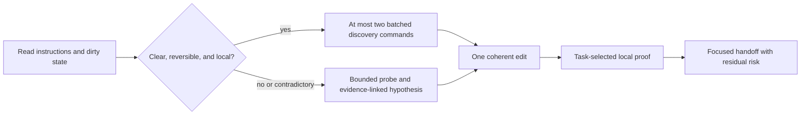

# Endurant Harness

### Verified repository changes without making ordinary coding tasks heavier

Endurant Harness is a lightweight Codex skill for substantial implementation and difficult debugging. Clear, reversible work takes a direct edit-and-proof lane. Uncertain or high-risk work gets bounded discovery, one coherent change, and staged executable evidence.

The project is deliberately not a project-management framework. It adds ceremony only when uncertainty, blast radius, or acceptance criteria make that ceremony useful.

> **Status:** v5 is an evaluation-backed release candidate. Its local and synthetic gates are documented below; remote CI is commit-specific in GitHub Actions, while a GitHub release and cross-platform packaging are not yet claimed.

## Contents

- [Get started](#get-started)
- [Why Endurant Harness](#why-endurant-harness)
- [Key features](#key-features)
- [How it works](#how-it-works)
- [Repository contracts](#repository-contracts)
- [Runtime commands](#runtime-commands)
- [Measured evidence](#measured-evidence)
- [Project layout](#project-layout)
- [Development and release](#development-and-release)
- [Limits](#limits)
- [License](#license)

## Get started

### Requirements

- Codex in the ChatGPT desktop app, CLI, or IDE extension
- Git
- Python 3.10 or newer
- `rg` recommended for task-aware repository search
- `rtk` only for coding-agent shell sessions following this repository's maintainer policy; human contributors and CI can run the documented commands directly, and it is not a skill runtime dependency

### 1. Clone and audit

```bash
git clone https://github.com/EndurantDevs/endurant-harness.git
cd endurant-harness

PACKAGE="$PWD/endurant-harness"
PYTHONDONTWRITEBYTECODE=1 python3 -S \
  "$PACKAGE/scripts/audit_skill.py" \
  "$PACKAGE" --strict --format text
```

### 2. Install from source locally

Codex officially discovers user skills under `$HOME/.agents/skills`. A symlink keeps the audited checkout as the source of truth:

```bash
mkdir -p "$HOME/.agents/skills"
TARGET="$HOME/.agents/skills/endurant-harness"
if [ -e "$TARGET" ] || [ -L "$TARGET" ]; then
  echo "refusing to replace existing target: $TARGET" >&2
  exit 1
fi
ln -s "$PACKAGE" "$TARGET"
```

For one repository, place or link the package at `.agents/skills/endurant-harness` in that repository instead. Before installing, remove or migrate any other discovered `endurant-harness` copy: Codex lists duplicate names separately rather than merging them. Direct folders are intended for local authoring and repository workflows; plugin packaging is the planned distribution path for broader reuse.

### 3. Invoke it

Start a Codex task and mention:

```text
$endurant-harness implement this change and prove it locally
```

Codex normally detects skill changes automatically. If an update does not appear, restart Codex. Because `AGENTS.md` is loaded once per run, start a fresh task when exact loaded-version certainty matters. In an existing task, explicitly invoke `$endurant-harness` on the next turn, but do not claim `current` provenance unless its loaded marker is supplied.

## Why Endurant Harness

- **Small tasks stay small.** Clear reversible changes skip probes, plan files, checkpoints, subagents, and broad test suites.
- **Discovery is bounded.** The direct lane allows at most two batched discovery commands before editing and escalates instead of continuing to inspect indefinitely.
- **Proof follows the task.** Performance work gets the same before/after synthetic workload and correctness checks; ordinary correctness work does not inherit an irrelevant benchmark.
- **Local failures arrive earlier.** Repository-owned preflight can cover focused, lint, type, build, generated-output, and affected-package checks before remote CI.
- **Existing work is protected.** Dirty worktrees and unrelated edits are identified and preserved.
- **Green output is not automatically proof.** The runner can require behavior evidence, intended-test output, deadlines, cleanup, and an exact final-diff fingerprint.

## Key features

| Feature | Purpose |
| --- | --- |
| Direct and escalated lanes | Spend discovery only when uncertainty or risk requires it |
| Symbol-first repository probe | Rank exact snake_case and camelCase source/test hits while suppressing unrelated harness noise |
| Task-selected verification | Choose focused, synthetic, affected-scope, local-CI, and diff checks from the requested behavior |
| Staged command runner | Execute explicit argv plans with timeouts, evidence kinds, bounded summaries, and full external logs |
| Configured false-green defenses | Require intended-test output and reject output mismatches, stale proof, deadline overruns, and post-proof diff mutation when the corresponding guards are enabled |
| Optional fast preflight | Run one trusted repository bundle plus only uncovered checks |
| Optional benchmark receipts | Bind unchanged workload and correctness across one baseline and one final measurement |
| Session provenance | Report `current`, `stale`, or `unknown` without pretending an active task reloaded |
| Standard-library runtime | Run without installing Python packages |

## How it works



The direct lane is for clear, localized work with a known proof path. Claimed behavior regressions add the regression first, observe it fail, then fix it. Features, internal refactors, and performance tasks do not manufacture a red step.

The escalated lane is for uncertainty, contradictions, coupling, performance, migrations, security, deployment, or material risk. It uses one bounded probe, one root-cause change, and one staged proof packet. If evidence contradicts the approach, the harness replans rather than stacking speculative edits.

## Repository contracts

`AGENTS.md` remains the canonical project guidance. Endurant adds three optional files under `.agents/`:

| File | Role |
| --- | --- |
| `endurant-harness-profile.md` | Human-readable project shape, commands, constraints, environment notes, and completion policy |
| `endurant-harness-preflight.json` | Trusted coverage map for one local-CI bundle plus uncovered checks |
| `endurant-harness-benchmarks.json` | Same-workload benchmark command, source/workload manifests, correctness keys, metrics, and threshold |

The JSON contracts are opt-in. They must be Git-tracked, clean, regular files and hash-pinned from the probe. Malformed, stale, symlinked, untracked, or proof-mutating contracts fail closed. Repositories without them keep the ordinary workflow and cost.

See [`endurant-harness/references/repository-profile.md`](endurant-harness/references/repository-profile.md) for schemas and examples.

## Runtime commands

The skill keeps one public standard-library entry point:

```bash
python3 -S "$PACKAGE/scripts/endurant.py" probe \
  --repo . --task "describe the implementation task"

python3 -S "$PACKAGE/scripts/endurant.py" template \
  > /tmp/endurant-proof-plan.json

python3 -S "$PACKAGE/scripts/endurant.py" run \
  /tmp/endurant-proof-plan.json --repo .

python3 -S "$PACKAGE/scripts/endurant.py" fingerprint --repo .

python3 -S "$PACKAGE/scripts/endurant.py" provenance \
  --loaded-provenance 'v5:<full-package-sha256>' --format json
```

`preflight` and `benchmark baseline|final` are usable only when their repository contracts exist and pass validation; otherwise use the ordinary workflow. The probe reports their content hashes so callers can pin the exact reviewed contract.

## Measured evidence

The adoption decisions came from isolated deterministic tests, adversarial receipt mutation, and normalized local Codex tasks rather than intuition alone.

| Decision | Local result | Outcome |
| --- | --- | --- |
| Combined direct lane | Median wall `98.703s -> 50.221s`; uncached input `-19.70%` on two paired repeats of one clear synthetic task | Adopted as the base |
| Git-aware aggregate probe | `35.282s -> 0.099s` on the measured aggregate workspace | Adopted |
| Symbol-first relevance | Source and test in top three `1/12 -> 12/12`; candidate-path payload `-88.24%`; full-probe median slightly improved | Adopted |
| Two-command discovery | Median wall `54.733s -> 39.268s`; uncached input `-38.30%`; ambiguity canaries escalated without edits | Adopted provisionally |
| Conditional red-first | Honest fail-before-edit proof in both bug runs; no forced red step in feature/refactor canaries | Adopted only for behavior regressions |
| Fast-preflight contract | Duplicate proof slice `295.892ms -> 149.000ms`; `6/6` seeded failures caught | Optional pilot |
| Benchmark receipt | Eight mutation classes rejected; `0.147ms` median comparator cost | Optional pilot; extra core wording rejected |
| Explicit lane allowlist | Same `80/80` classification accuracy but `15.44%` slower | Rejected |
| Full Rust rewrite | Optimistic runtime ceiling remained below one percent of an end-to-end task and lacked CLI/platform parity | Rejected |
| v5 runtime safeguards | `+9.6ms` to `+11.8ms` median across 31 paired template, probe, and no-op runner samples; all parity gates passed | Accepted as negligible for real proof commands, not claimed as a runtime speedup |
| Provenance UX forward A/B | On two pairs, wall median `71.525s -> 61.033s`, uncached input `28,451 -> 19,621`, and provenance commands `3 -> 1`; all functional gates passed, while exact `current` provenance improved `1/2 -> 2/2` | Retain the current UX; favorable exploratory signal, not a general speed claim |

These are bounded local and synthetic results, not universal throughput claims. The full decision records, sample limits, hashes, and sanitized receipts are in [`reports/DECISION.md`](reports/DECISION.md), [`reports/NEXT-IMPROVEMENTS.md`](reports/NEXT-IMPROVEMENTS.md), [`reports/PROVENANCE-EFFICIENCY.md`](reports/PROVENANCE-EFFICIENCY.md), and [`artifacts/benchmarks/`](artifacts/benchmarks/).

## Project layout

| Path | Purpose |
| --- | --- |
| `endurant-harness/` | Audited installable v5 skill and release source |
| `subjects/current/` | Frozen pre-v5 installed baseline |
| `subjects/combined-candidate/` | Previously promoted base candidate |
| `subjects/<experiment>/` | Isolated experimental variants |
| `lab/` | Benchmarks, graders, proposal prototypes, integrity tests, and release checks |
| `fixtures/` | Neutral executable synthetic coding tasks |
| `artifacts/benchmarks/` | Sanitized reproducible receipts and aggregate measurements |
| `artifacts/runs/` | Ignored raw model output, logs, event sinks, and generated workspaces |
| `reports/` | Decisions, measured results, caveats, and rollout notes |

The project README stays at the repository root. The installable skill and release ZIP intentionally contain no README, changelog, cache, bytecode, raw run, or temporary file.

## Development and release

Run the deterministic suite, strict skill audit, efficiency comparison, aggregate promotion checker, and staged local preflight before publishing a package:

```bash
PYTHONDONTWRITEBYTECODE=1 python3 -m unittest discover \
  -s lab/tests -p 'test_*.py' -v

PYTHONDONTWRITEBYTECODE=1 python3 -S \
  endurant-harness/scripts/audit_skill.py \
  endurant-harness --strict --format text

PYTHONDONTWRITEBYTECODE=1 python3 -S \
  endurant-harness/scripts/benchmark_efficiency.py \
  endurant-harness \
  --baseline-skill subjects/current/endurant-harness \
  --format text

PYTHONDONTWRITEBYTECODE=1 python3 -S lab/check_results.py

PYTHONDONTWRITEBYTECODE=1 python3 -S \
  lab/provenance_efficiency_receipt.py check

PYTHONDONTWRITEBYTECODE=1 python3 -S \
  endurant-harness/scripts/endurant.py run \
  lab/local-ci-plan.json --repo .

PYTHONDONTWRITEBYTECODE=1 python3 -S \
  lab/build_v5_release.py verify-source \
  --package endurant-harness \
  --receipt artifacts/benchmarks/v5-release.json \
  --runtime-receipt artifacts/benchmarks/v5-runtime.json
```

The tracked source-only check reconstructs the deterministic archive in memory, so CI can verify its hash without storing release binaries. A local archive can be built with `python3 -S lab/build_v5_release.py build`; it must contain exactly one top-level `endurant-harness/` directory. Record the source revision, canonical package hash, strict-audit result, deterministic test result, benchmark receipt, archive SHA-256, and what was not verified.

## Limits

- Endurant Harness is for implementation and difficult debugging, not explanations, review-only work, or trivial edits.
- Local preflight does not prove remote CI, deployment, readiness, or live behavior.
- Current performance evidence uses synthetic tasks and limited repeated model runs.
- Fast-preflight and benchmark contracts are optional pilots; repository commands still execute with the caller's ambient authority.
- Existing tasks may retain older instructions. Missing or malformed loaded provenance is `unknown`, never `current`.
- The current release is Python-based. Rust microbenchmarks did not justify a parity rewrite.
- Cross-platform release packaging has not yet been demonstrated.
- The strict audit validates package structure and declared capability/runtime gates; it is not a security review or source-authenticity proof. Package hashes identify version and integrity state, not publisher identity.

## License

No reuse license has been selected yet. Public availability of this repository is not a substitute for a license grant.

## Acknowledgements

The README structure borrows the useful outcome-first organization of [Ancienttwo/repo-harness](https://github.com/Ancienttwo/repo-harness). Endurant Harness intentionally chose a smaller runtime workflow after measuring the cost and quality trade-offs locally.

Codex skill installation and reload behavior follow the [official OpenAI skill documentation](https://learn.chatgpt.com/docs/build-skills); active `AGENTS.md` instruction-chain behavior follows the [official AGENTS.md documentation](https://learn.chatgpt.com/docs/agent-configuration/agents-md).
